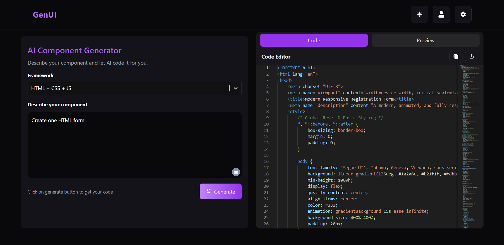

# AI COMPONENT GENERATOR



## 🚀 Overview

A modern web application built using **React**, **Vite**, and **Tailwind CSS**. This template provides a fast setup for building scalable front-end projects while enabling rapid styling and hot reloading for efficient development[3][4][15].

## ✨ Features

- React component-based structure for maintainability[12].
- Vite for ultra-fast dev server and builds[6].
- Tailwind CSS for utility-first, customizable design[9].
- Hot module replacement for instant updates.
- ESLint integration for consistent code quality.
- Configuration files for easy customization.

## 📁 Project Structure

project-root/
├── public/
│ └── homepage.png # Homepage image (shown above)
├── src/
│ └── Home.jsx # Main home component
├── .gitignore
├── README.md
├── eslint.config.js
├── index.html
├── package-lock.json
├── package.json
├── postcss.config.js
├── tailwind.config.js
├── vite.config.js

[19]

## ⚙️ Configuration

- **Tailwind CSS:** Configured via `tailwind.config.js` and `postcss.config.js` for easy custom styling.
- **Vite:** Project setup managed through `vite.config.js` for speedy builds.
- **ESLint:** Ensures code quality with `eslint.config.js`.
- **API_KEY:** Update Your GEMINI_API_KEY in Homepage.jsx file.

## 🛠️ Setup

1. Clone the repository:
    ```
    git clone https://github.com/Ssumit09/project.git
    cd project
    ```
2. Install dependencies:
    ```
    npm install
    ```
3. Start the development server:
    ```
    npm run dev
    ```
4. View the app in your browser at `http://localhost:5173`.
   
## 📄 License
For questions or feedback, feel free to open an Issue or a Pull Request.
This template covers project overview, structure, installation, configuration, and best practices for displaying images in your README.[2][3][1]
